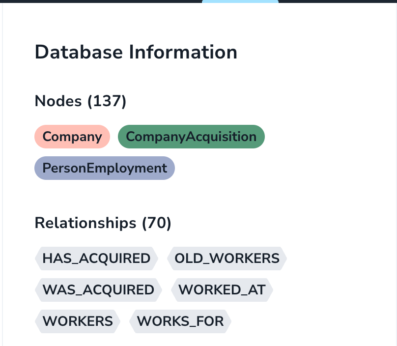
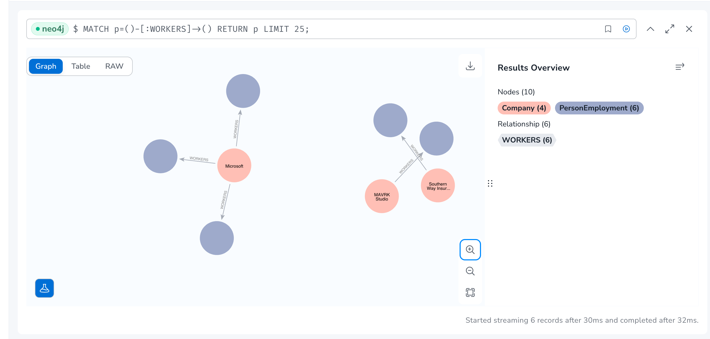

# Startup Time!
Startup Time is an application that lets you create and explore a Knowledge Graph of information relating to ***Companies, Employees and Acquisitions***. You can import JSON data which will get uploaded to a Neo4j Database and then you can query the data as you please with a few preset relationships built in. 

Check out the live version of the app here: [Startup Time](https://harmonic-startup.vercel.app/)

## Features
- Ability to Import 3 various types of Graph Nodes: *Company*, *CompanyAcquisition*, and *PersonEmployment* via an Import API
- Query the database using Neo4j's cypher query language via a Discover API
- View query results in a JSON editor format
- Add new nodes as you please and be able to query them in real-time post upload

### Future Enhancements & Fixes
- Ability to add new relationships to nodes via the query editor (Its read only atm)
- Improved sanitization of query input on API
- Enhanced Error Reporting & Telemetry (via Sentry/Datadog/etc.)
- View previous import history and get notified on failed uploads
- Robust Integraiton and E2E Tests (React Testing Library, Cypress, Jest, etc.)
- Fix Bootstrap Component CSS issue on live build

## Development

To run the application locally please run:

```bash
pnpm dev
```

Then open [http://localhost:3000](http://localhost:3000) with your browser to see the result locally.

You will need to setup your own [Neo4j Graph database](https://neo4j.com/) and provide the proper environment variables 


# Requirements

This application had 3 core requirements:
- Design & Initialize a knowledge graph with the sample data
- Be able to support streaming to dynamically update the knowledge graph with new entities & relationships
- Be able to query for relationships (either UI, API, or other creative methods you can think of)

### Approach
1) Modeled the nodes based on the JSON data provided - created the 3 Node types above and created the relationships within my Neo4j Instance:


The current relationships are:
- *HAS_ACQUIRED*: Company -> CompanyAcquisition
- *WAS_ACQUIRED*: CompanyAcqusition -> Company
- *WORKERS*:      Company -> PersonEmployment (has an empty or NULL PersonEmployment.end_time)
- *OLD_WORKERS*:  Company -> PersonEmployment (has a PersonEmployment.end_time)
- *WORKED_AT*:    PersonEmployment -> Company (has a PersonEmployment.end_time)
- *WORKS_FOR*:    PersonEmployment -> Company (has an empty or NULL PersonEmployment.end_time)

These relationships were all created via a cyper query within the portal. Here is a sample:
```cypher
(HAS_ACQUIRED) Company -> CompanyAcquisitions 

MATCH (c:Company), (ca:CompanyAcquisition)
WHERE c.company_id = ca.parent_company_id
CREATE (c)-[:HAS_ACQUIRED]->(ca)
```

2) Created a serverless import API (`/api/import?type={type}`) that could handle all 3 node types, massage the incoming JSON data and then crate Nodes in Neo4j. I exposed this endpoint via a `/import` page in my application that allows a user to select a JSON file from their local machine to add new nodes. I made sure to also add a uniqueness constraint on the data to ensure that future uploads would allow updating existing nodes and not create duplicates nodes. I also had to add a fair amount of error handling/guards to massage the data as certain props did not exist for some users (i.e. start_time)

3) Created a `/discover` page in the application to which hits an API (`/api/discover`) to allow a user to enter a valid Cypher query and see the response from the database in a JSON format to extract/parse as they need.

## Project Goals
One of the main goals for creating this application was to a) showcase my coding skills across the stack and b) learn new technologies and concepts in the process

The latter really helped influence my decision on the tech stack for this project - I have never used a Graph database in my professional career and I also have been ramping up on learning the Next.js framework to build applications for some other personal projects so I wanted to get even deeper on the new app router and api handling that was introduced in v13.0.

Using new technologies was quite an experience and required me to ramp up on:
- How Graph Databases work in general (creating nodes, relationships, etc.)
- Learning a brand new query language, Cypher
- How to model data for a graph DB
- Understanding how to integrate a cloud database in a serverless environment like Next.js
- Handling streaming data in a serverless Node environment without using a Express.js

***Being a modern fullstack engineer, I leaned on Documentation & ChatGPT to ramp myself up as quickly as possible to get the job done. I hope it showcases my ability to take on challenging projects, tackle problems I've never seen before and learn REALLY quickly to get the job done!***
## Tech Stack

### Frameworks & Libraries

- ***Next.js w/ React*** for developing my application Frontend & serverless API routes. I tried to leverage SSR (Server Side Rendering) in as many components as possible to create a snappy application. This also helped me deploy to a live build as I made progress which was awesome.
- ***React-Bootstrap***: easy component library to get up and running with Dropdowns, forms, etc.
- ***Tailwind CSS***: modern CSS library to add styles inline in HTML for speedy development


### Database
I felt that this was the heart of the problem, and a traditional relational database like MySQL or Postgres *could* work, but I felt that since we are creating a knowledge graph, it seemed logical to use ***Neo4j*** to handle the various relationships required (and make adding future nodes/requirements a breeze). A typical relational database would introduce a number of joins to get the same amount of data in a less efficient way, not to mention the data was already in a semi-unstructured format and the graph format would allow easily adding new properties to Nodes if needed.

I also have never encountered a Graph problem like this in my professional work, so I felt it was a great opportunity to learn a new critical piece of tech like this to help me solve new types of problems in the future!

Visualizing the data was also super cool with Neo4j:


***Alot of the work I did ended up being within the Neo4j Aura DB portal, happy to showcase this in person in the next steps!***

## Challenges/Learnings
- Figuring out what direction to take this project was the hardest part IMO - I felt that I wanted to showcase my FE skills and I'm happy that I was able to make a single-page-app to meet all the requirements and learn a new type of database along the way.
- I realized Neo4j does not like NULL values - I had to add some safeguards in the API to massage the data to avoid errors on import
- Learning the cypher query language was quite an experience - it was definitely a different way of thinking compared to SQL syntax, but it also did feel more natural to create relationships and connect the dots as its closer to how humans think
- Avoiding Express.js in the Next.js environment was a doozy, especisally when it came to handling utf-8 streams. I had to add some helper methods to help extract the info on both API's which is much easier to do in Express.js


# Closing Thoughts
- I'm bummed I wasn't able to add more tests due to me having to timebox the project, but I placed a very strong emphasis on good code organization and style within folders/files
- Ramping up on Neo4j and non-express API routes is where I spent alot of the time. Once that part was figured out it was clear how powerful the framework is and how nice it is to build w/ serverless + hosted DBs for these kinds of projects
- I saw lots of value in learning a graph database schema - this is something I'm really happy I got to work with and think I have a better understanding of how apps like Facebook/LinkedIn are working under the hood :) 
- No need for SWR data fetching at the moment (only making POST calls in the app today) but I would like to introduce it when needed to leverage its powerful caching features
- Found it interesting there was no need for much state management like React Context/Redux & the Next.js app route is super easy and powerful to use
- Uploads are subject to Lambda timeouts but that is a problem for scale!


# Contact

Hope you enjoyed learning about my experience building this applicaiton and don't hesitate to contact me at vtumrukota@gmail.com